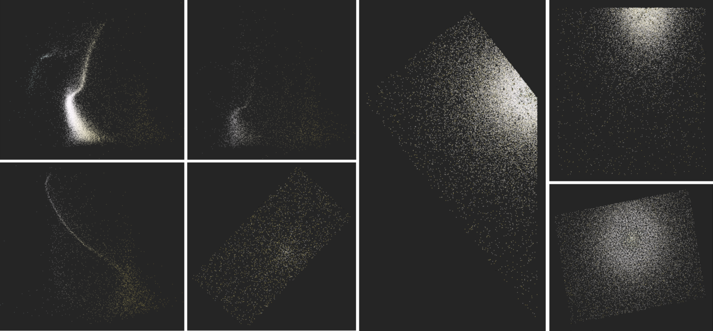

# StarClusterPlot
 \
**StarClusterPlot** is a Python package that helps visualize a star cluster's structure and its Hertzsprung-Russell Diagram with color correspond to star's temperature. This Library is specifically designed to work with data from the Sloan Digital Sky Survey but should also work with any dataset that contains g, r, right ascension, and declination values.

The package includes three functions: 
 - ClusterVis()
 - HRDiagram()
 - Temp_to_RGB()

Interactive application and library tutorial can be found [here](https://starclusterplot.streamlit.app/) \
PyPI page [here](https://pypi.org/project/StarClusterPlot/)